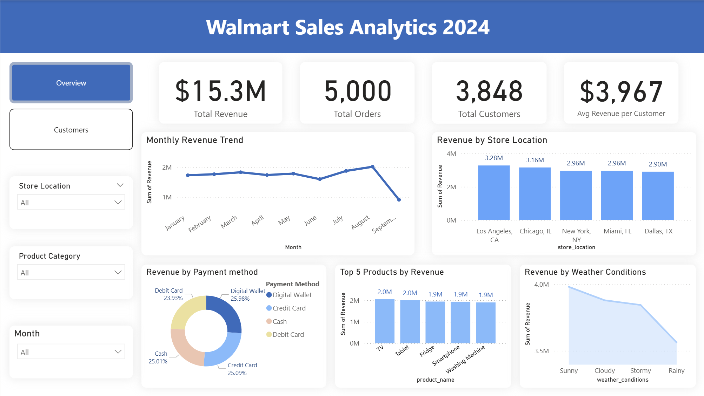

# Walmart Sales Analysis & Customer Insights 2024
## Project Overview
This project analyzes Walmart's sales performance and customer behavior data for 2024. By analyzing transactional sales data, the project identifies revenue drivers, evaluates geographical performance, and segments customers to provide actionable business recommendations.

## Dashboard Preview

### Sales Overview



## Dataset
The dataset contains historical Walmart sales data sourced from Kaggle, including:
-	Order details (date, quantity, revenue) 
-	Store location 
-	Product category and product name 
-	Customer information (loyalty level, gender) 
-	Payment method and weather conditions 


## Data Processing
The dataset was cleaned and transformed using Python (Pandas). 

- Standardizing the `transaction_date` column using `pd.to_datetime()` with mixed formats 
- Validating missing values in the dataset 
- Creating calculated fields such as Revenue (`quantity_sold * unit_price`) 
-	Exporting the cleaned dataset for SQL analysis and Power BI visualization 


## Key Insights & Findings
### 1. Sales Performance & External Factors
-	**Revenue Seasonality:** Revenue remained stable (~$2M/month) before a sharp decline in September.
-	**Weather Impact:** Sales show high sensitivity to weather conditions; Sunny days generated the highest revenue ($4M), while Rainy days saw the lowest ($3.5M)
-	**Product Drivers:** High-ticket items like TVs, Tablets, and Fridges are the primary revenue contributors, supporting a total annual revenue of $15.3M.

### 2. Customer Behavior Analytics
-	**Retention Challenges:** The Repeat Purchase Rate stands at 25%, with an average of only 1.3 orders per customer, indicating low customer retention and growth potential.
-	**Loyalty Tier Value:** The Platinum tier is the most valuable segment, contributing the highest revenue ($4.01M) compared to other tiers.
-	**Acquisition Trends:** The number of New Customers peaked in March but has shown a steady downward trend leading into September.

### 3. Geographical & Payment Insights
-	**Top Market:** Los Angeles, CA is the leading store location, contributing $3.28M in revenue with a customer base of 982.
-	**Payment Preferences:** Payment methods are remarkably balanced, with Digital Wallets (25.9%), Credit Cards (25.1%), and Cash (25.0%) sharing nearly equal transaction volumes.


## Tech Stack
-	**Python (Pandas):** Used for data cleaning and preprocessing, including standardizing date formats.
-	**SQL Server:** Data storage, complex querying, and KPI calculation (Revenue, AOV).
-	**Power BI:** Advanced data visualization and interactive dashboard development.
 

## Project Structure

```bash
walmart-sales-analysis/
│── data/              # Processed datasets
│── notebooks/         # Data preprocessing
│── powerbi/           # Dashboard files
│── sql/               # SQL queries
│── README.md
```

## Actionable Recommendations
-	**Boost Retention:** Launch personalized campaigns targeting one-time buyers to increase repeat purchase rate.
-	**Weather-Responsive Marketing:** Increase digital marketing spend and promote home delivery services during Rainy periods to offset lower in-store foot traffic.
-	**Recovery Strategy:** Investigate the specific causes of the September slump to develop defensive promotional strategies for the following Q3.


## Author
**Mach To My**
Python | SQL | Power BI 
📧 mymach26@gmail.com
